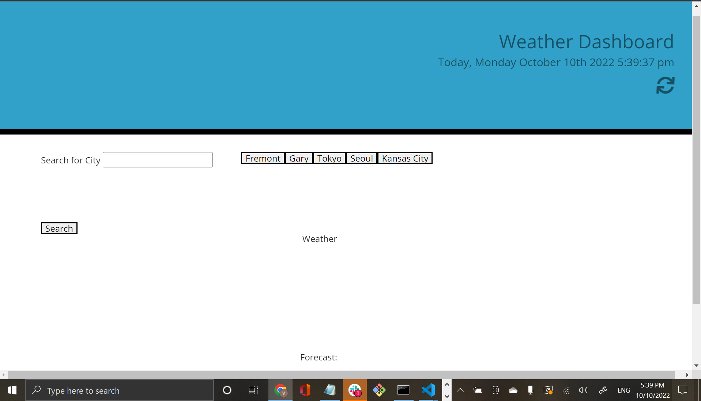

# Weather Dashboard

## Deployable Link

https://elduderino23.github.io/apparao-vasu-weather/

## Goal
The task was to make a weather dashboard that showed the current weather, including the name; date; weather icons that represent conditions, the temperature, the wind speed, and the humidity.

## Technology Use
  - Javascript
  - HTML
  - CSS
  - Bootstrap
  - JQuery
  - Open Weather API
  - Moment.js
  - VS Code
  - Git Bash 
  - GitHub

## Execution
The first part of making the weather dashboard operational was to make the HTML and CSS. Luckily with Bootstrap, structuring the index.html file was not overbearing. Since the website was mainly for displaying the current weather and a five day forecast, the style.css sheet was relatively anemic. The real work behind the website was situated in the Javascript. The first thing that was put into the javascript was a continuos clock that is situated in top right corner of the website. It displays the the real time a user access the website.

The function in order to make this happen is shown below:

```Javascript
 var weatherClock = function () {
        var presentClock = moment().format('[Today], dddd MMMM Do YYYY h:mm:ss a')
        $("#presentDay").text(presentClock)
    }
    setInterval(weatherClock, 1000)
```
presentDay was the id in the HTML that controlled the date so adding a function that calculated the present time, in the form of a variable aptly named presentClock, display the time in real time. The interval down below set the time for every 1000 millisecond, one second.

The second part of tackling the Javascript was making an API call for the weather. In order for any API to work, one needs an API key. After receiving the key from the Open Weather website, a function had to be created to call for the forecast of any given city and another function for the longitude and latitude in order to make displaying the weather of any given city possible.

The set up is shown below:

```Javascript
function retrieveAPI() {
    var city = document.getElementById("city").value
    console.log(city)
    if(!searchHistory.includes(city)){
        searchHistory.push(city)
    }
    localStorage.setItem('retrieveAPI', JSON.stringify(searchHistory));
    var requestSite = 'https://api.openweathermap.org/data/2.5/forecast?q=' + city + '&appid=cf1929056b460b4693a80b30482c21ed&units=imperial'

    fetch(requestSite)
        .then(function (response) {
            return response.json();
        })
        .then(function (data) {

            console.log(data)
            var forecastListEl = document.getElementById("js-forecast-list")
            forecastListEl.innerHTML = ""
            for (let i = 0; i < 5; i++) {
                renderForecastCard(data.list[i], i)
            }

            var lon = data.city.coord.lon
            var lat = data.city.coord.lat
            var requestNew = 'https://api.openweathermap.org/data/2.5/weather?lat=' + lat + '&lon=' + lon + '&appid=cf1929056b460b4693a80b30482c21ed&units=imperial'

            fetch(requestNew)
                .then(function (response) {
                    return response.json();
                })
                .then(function (data) {
                    var forecastListE0 = document.getElementById("weather")
                    forecastListE0.innerHTML = ""
                    renderOriginForecastCard(data)
                    console.log(data)


                })

        })
}
```
In order to display the weather conditions with picture icons and information two functions had to be made. The function that shows the current day's weather, renderOriginForecastCard, displays today's weather while the forecast function, renderForecastCard, displays the the five day forecast. 

Both functions are shown below:

```Javascript
function renderOriginForecastCard(todayWeather) {
    console.log(todayWeather)
    var dayOne = moment().format("MMM Do YY")
    var forecastListE0 = document.getElementById("weather")
    var cardOneHTML = `
<div class="card">
  <div class="card-body">
  <p class="card-text">${dayOne}</p>
  <p class="card-text">${document.getElementById("city").value}</p>
  temp: ${todayWeather.main.temp}</p>
    <p class="card-text">wind speed: ${todayWeather.wind.speed}</p>
    <p class="card-text">wind gust: ${todayWeather.wind.gust}</p>
    <p class="card-text">humidity: ${todayWeather.main.humidity}</p>
  </div>
</div>
`
    var listItemOne = document.createElement("li")
    listItemOne.innerHTML = cardOneHTML
    forecastListE0.appendChild(listItemOne)
}
function renderForecastCard(weatherObject, i) {
    console.log(weatherObject)
    var dayNext = moment().add(i + 1, 'days').format("MMM Do YY")
    var forecastListEl = document.getElementById("js-forecast-list")
    var cardHTML = `
<div class="card">
  <div class="card-body">
  <p class="card-text">${dayNext}</p>
  <p class="card-text">${document.getElementById("city").value}</p>
    
    <p class="card-text">temp: ${weatherObject.main.temp}</p>
    <p class="card-text">wind speed: ${weatherObject.wind.speed}</p>
    <p class="card-text">wind gust: ${weatherObject.wind.gust}</p>
    <p class="card-text">humidity: ${weatherObject.main.humidity}</p>
  </div>
</div>
`
    var listItem = document.createElement("li")
    listItem.innerHTML = cardHTML
    forecastListEl.appendChild(listItem)
}
```
After creating the functions that show the current weather and the 5 day forecast, The next stage was to make each city be saved in localStorage and be pulled out in order to generate buttons for cities in previous history to be clicked on and seen. A global variable had to be made in order to get items out of local storage and then, with a combination of a for loop and appending elements with the button as seen below:

 ```Javascript
var searchHistory = JSON.parse(localStorage.getItem("retrieveAPI")) || [];

for (let i = 0; i < searchHistory.length; i++) {
    var historyBtn = document.createElement("button")
    historyBtn.textContent = searchHistory[i]
    historyBtn.addEventListener("click", function () {
        var city = (searchHistory[i])
        document.getElementById("city").value = city
        retrieveAPI()
    })
    document.getElementById("history").append(historyBtn)
}
 ```
The for loop above relies on the array generated from the API calls get saved in localStorage and then pulls the search results out of localStorage in order to generate a clickable history list that doesn't repeat multiple searches of the same city but keeps the new cities displayed. the part is the fetch button itself shown below:

```Javascript
fetchButton.addEventListener('click', retrieveAPI)
```
## Result

The following website demonstrates what the final product looks like:
